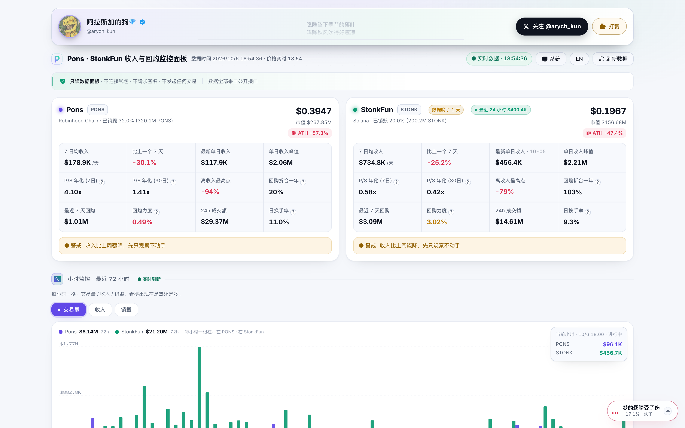
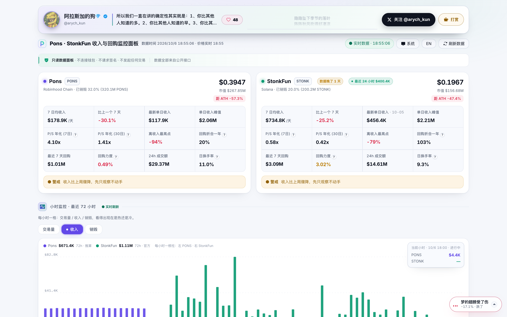
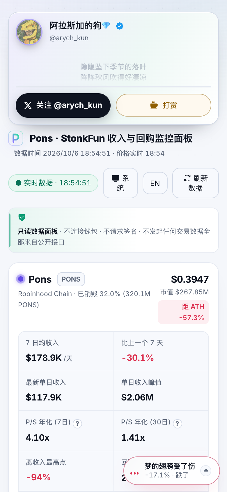

# Pons & StonkFun 收入与回购监控看板

给社区看的一块实时数据面板，盯 **Pons（$PONS · Robinhood Chain）** 和 **StonkFun（$STONK · Solana）**
的收入、回购销毁、估值、市场占有率和小时级资金动向。数据全部来自公开接口，每小时自动刷新。

🌐 在线看板 **https://stonk1000x.top** ｜ 备用域名 **https://ponsfi.xyz** ｜ 作者 [@arych_kun](https://x.com/arych_kun)



| 小时监控 | 手机端 |
| --- | --- |
|  |  |

---

## 中文

### 做这个东西的起因

这两个项目都在拿协议收入回购并销毁自己的代币，所以判断"回购还撑不撑得住"看的是收入趋势，不是价格。
可这些数字散在 DefiLlama、两边官网、链上浏览器和 DEX 数据站，看一轮要开五六个页面，
而且各家口径和更新时间都不一样。这个面板把它们摊在一页上，每小时抓一次，源站延迟如实标出，不做修饰。

### 看板上有什么

按页面从上到下的顺序：

- **关键指标** 市值、年化收入、P/S 年化（7 日 / 30 日）、回购力度、环比走势，先看贵不贵、回购还有没有劲。
- **该做什么** 五个关键指标对照阈值给出结论：离场线、警戒线、机会线，后面附一段数据解读。
- **小时监控（最近 72 小时）** 交易量 / 收入 / 销毁 三个页签，每小时一根柱子，鼠标划过或手机点按读到那一小时的数值。
- **回购与销毁** 24 小时和 30 天两档回购榜，含全市场对照；Pons 的链上销毁逐区块核对，另有销毁进度环。
- **市场占有率** PONS 占 Robinhood Chain 全链 DEX 成交量的比例，STONK 在 Solana 上跟 pump.fun 的对比。
- **收入排行** 这两个项目在 DefiLlama 全行业收入榜里的名次与变化。
- **趋势图和日度明细** 日收入 / 回购曲线，加上最近 20 天的逐日数据表。
- **边角料** 数据源体检、指标说明、行情 BGM（涨跌自动切歌，带歌词）、共勉与点赞、打赏入口、访问量统计。

中英双语跟随浏览器语言自动切换，深浅色跟随系统。

### 数据来源

| 数据 | 来源 |
| --- | --- |
| 日收入 / 每日回购 | DefiLlama Fees API |
| 市值 / 价格 | DefiLlama Protocol API、coins.llama.fi |
| 小时交易量 | GeckoTerminal OHLCV（PONS/WETH、STONK/SOL） |
| Pons 链上销毁 | Robinhood Chain RPC，逐区块读销毁事件 |
| StonkFun 官方口径 | stonkfun.xyz 官方 API，累计值逐小时做差 |
| 市场占有率 | DefiLlama DEX 接口（协议成交量 ÷ 所在链总量） |
| 全行业排行 | DefiLlama Fees overview |

> 本看板只做数据展示，不构成投资建议；不连接钱包、不请求签名、不发起任何交易。

### 目录结构

```
work/       采集 / 渲染 / 上线脚本，template.html 是页面唯一母版
outputs/    构建产物，每小时生成 pons-stonkfun-monitor.html
deploy/     服务器侧文件（nginx 配置、访问计数服务、部署说明）
docs/       README 用到的截图
work/看板维护说明.md   详细的维护与改动指南
```

### 快速开始

```bash
# 用现有数据快照重新渲染页面，不联网，最快
python3 work/render_only.py

# 完整刷新流程：拉数据 → 渲染 → 上线
python3 work/hourly_check.py
```

自动化：本机 LaunchAgent `com.ponspulse.hourly` 每小时第 5 分钟跑一次 `work/hourly_check.py`，
上线成功后调用 `work/git_sync.py` 把源文件推到 main、整站快照推到 snapshots 分支，并自动打版本标签。

### 版本

标签形如 `v3.5`（功能版）和 `v3.5.1`（补丁版），说明自动生成。历史版本在本仓库 **Tags** 页逐版可查。
手动发版：改 `work/render_only.py` 里的 `VER`，然后正常上线一次。

### 支持作者

看板由我一个人利用业余时间开发维护，数据每天手动核对。如果它帮到了你，欢迎请我喝杯咖啡 ☕

- EVM `0xa7f6cc31b6b5454b0eb705e5b56ebfc320e7b5b9`
- Solana `EEchRHEuNiMZrHaEVgW1UxtGZwHx4S4JEhW12uGuuQKq`

> 只认上面这两个地址。任何让你点链接、输助记词、点「授权」的，都是骗子。

---

## English

### Why this exists

Both projects buy back and burn their own tokens using protocol revenue, so the question of whether buybacks
can keep holding comes down to the revenue trend, not the price. Those numbers are spread across DefiLlama,
two project sites, block explorers and DEX data tools, with different definitions and update times.
This dashboard puts them on one page, refreshes hourly, and labels stale source data instead of smoothing it over.

### What's on the page

In order from the top:

- **Key metrics**: market cap, annualized revenue, P/S (7d / 30d), buyback intensity, week-over-week trend.
- **What to do now**: five indicators checked against exit / warning / opportunity thresholds, with a written read on the data.
- **Hourly monitor (last 72h)**: volume / revenue / burn tabs, one bar per hour; hover or tap to read that hour's numbers.
- **Buybacks & burns**: 24h and 30d buyback boards with market-wide comparison; Pons burns verified block by block on-chain.
- **Market share**: PONS share of Robinhood Chain DEX volume, STONK vs pump.fun on Solana.
- **Revenue ranking**: where the two projects sit on DefiLlama's protocol revenue leaderboard.
- **Charts and daily table**: daily revenue / buyback curves plus 20 days of per-day detail.
- **Extras**: data-source health check, metric explainers, market-mood music player with lyrics, community quotes with likes, tip jar, page-view counter.

Chinese / English switch follows browser language; light / dark follows the system.

### Data sources

| Data | Source |
| --- | --- |
| Daily revenue / buybacks | DefiLlama Fees API |
| Market cap / price | DefiLlama Protocol API, coins.llama.fi |
| Hourly volume | GeckoTerminal OHLCV (PONS/WETH, STONK/SOL) |
| Pons on-chain burns | Robinhood Chain RPC, burn events read block by block |
| StonkFun official figures | stonkfun.xyz official API, cumulative counters diffed hourly |
| Market share | DefiLlama DEX endpoints (protocol volume ÷ chain total) |
| Industry ranking | DefiLlama Fees overview |

> For informational purposes only, not financial advice. The dashboard never connects a wallet,
> requests a signature, or sends a transaction.

### Repository layout

```
work/       collection / rendering / deployment scripts; template.html is the single source of truth
outputs/    build artifacts, regenerated hourly
deploy/     server-side files (nginx config, visit counter, deployment docs)
docs/       screenshots used in this README
```

### Quick start

```bash
python3 work/render_only.py    # re-render from the latest data snapshot (offline)
python3 work/hourly_check.py   # full refresh: fetch -> render -> deploy -> sync
```

### Versioning

Release tags look like `v3.5` (features) or `v3.5.1` (patches), each with an auto-generated changelog.
Browse them on this repo's **Tags** page.

### Support the author

Built and maintained solo in spare time. If it helps you, a coffee is appreciated ☕

- EVM: `0xa7f6cc31b6b5454b0eb705e5b56ebfc320e7b5b9`
- Solana: `EEchRHEuNiMZrHaEVgW1UxtGZwHx4S4JEhW12uGuuQKq`

> Only the two addresses above are mine. Anyone asking you to click a link, enter a seed phrase,
> or approve a transaction is scamming you.

---

## License

MIT
